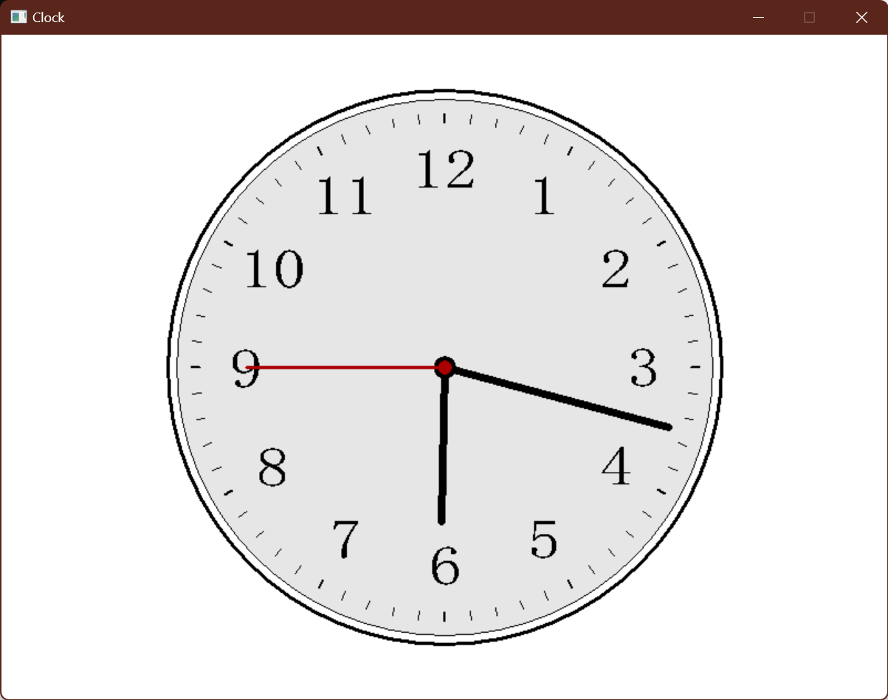
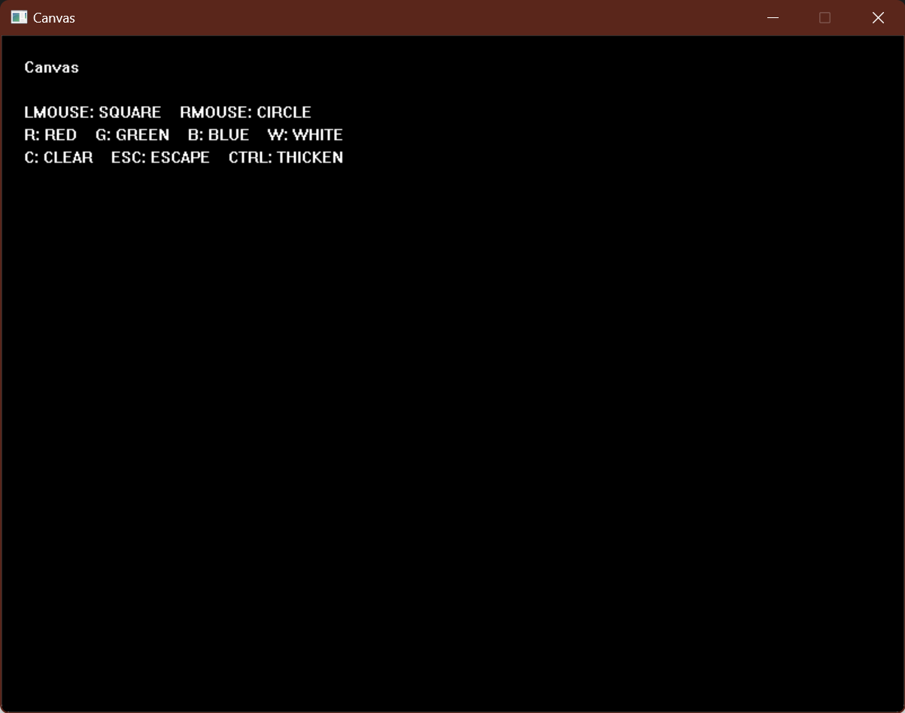
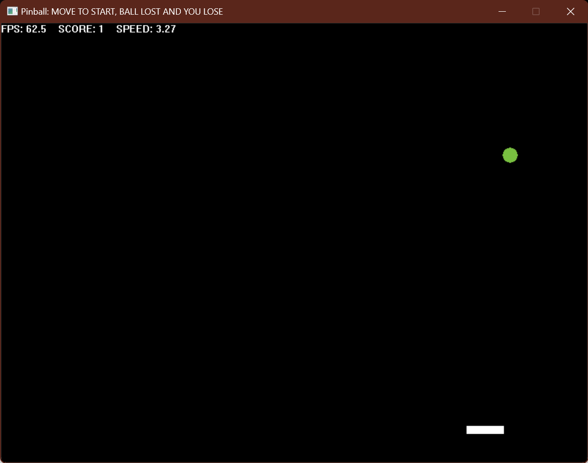
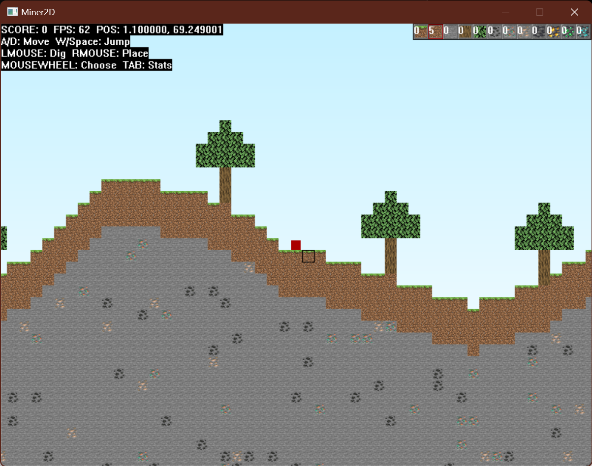
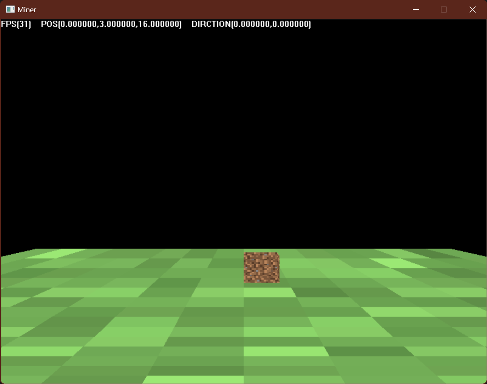

# DLUT Practice of Programming

大连理工大学程序设计开发实践课后作业。使用 EasyX 绘图库实现各种各样的程序。

## Clock

调用 `GetLocalTime(&time)` 获取本机时间并绘制时钟，主要使用 EasyX 的各种绘图函数。

## Canvas

简单的画图软件，使用 EasyX 处理各种输入事件。

1. 鼠标按下左键画 10*10 的正方形、按下右键画半径为 10 的圆（鼠标点击的位置为图形中心）
2. 同时按下 Ctrl 键和鼠标左、右键，分别画 20*20 的正方形和半径为 20 的圆
3. 按下键盘 C 键清屏、R/G/B/W 键分别修改画图颜色为红、绿、蓝、白，ESC 键退出

## Pinball

基于 EasyX 实现的基本游戏框架，利用 `GetTickCount()` 实现固定帧率运行。

1. 一个自由运动的小球，碰到左、右、上边界会反弹，碰到下边界结束程序
2. 一个键盘控制的挡板，在屏幕下方只能左右移动，不能超出屏幕边界，小球碰到挡板后会反弹

## Miner2D

对某沙盒游戏的 2D 拙劣模仿，通过 `srand()` 生成关于 seed 的随机数，并通过拉格朗日多项式插值生成地形。

## Miner(WIP)

基于 EasyX 的软光栅，但是基本片元是四边形而不是三角形。使用自己实现的线性代数库完成矩阵变换，使用逆双线插值法绘制贴图。

